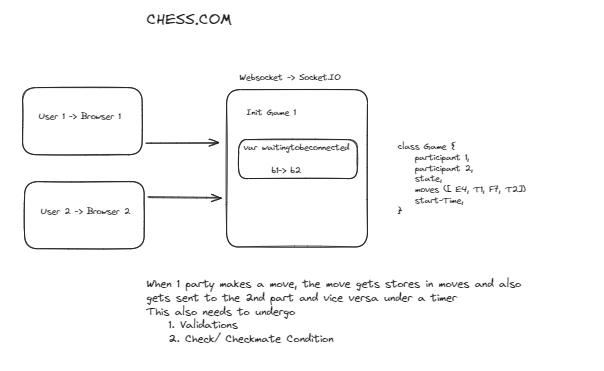
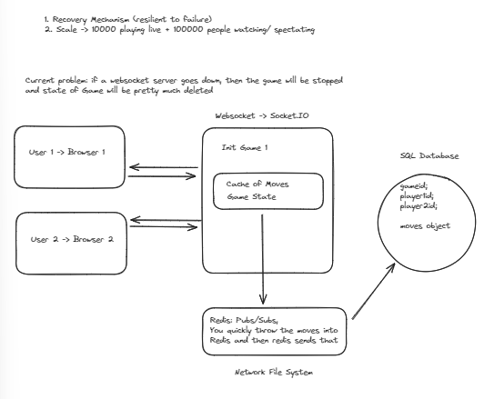

## Chess

Building a platform where people can

1. Sign up
2. Create a new match/get connected to an existing match
3. During the match, let users play moves
4. Have a rating system that goes up and down similar to standard chess rating

## Tech stack

Let's keep it simple

1. React for Frontend
2. Node.js for Backend
3. Typescript as the language
4. Separate Websocket servers for handling real time games
5. Redis for storing all moves of a game in a queue

# LLD

- 
- 

# Todo

Let's create a simple postgres table + Prisma for ORM which stores all the game information

- Whenever a new game is started, create an entry in the game table
- As the users make moves, store it in a moves DB which has a foreign key to the game table
- Add ids to every created game and add a new event that let's users re-join a game with a given id if their wifi went down/ws conn reset
- If a user wants to join a game and there is no in memory Game objec for it, recover the game from DB and put it back in memory
